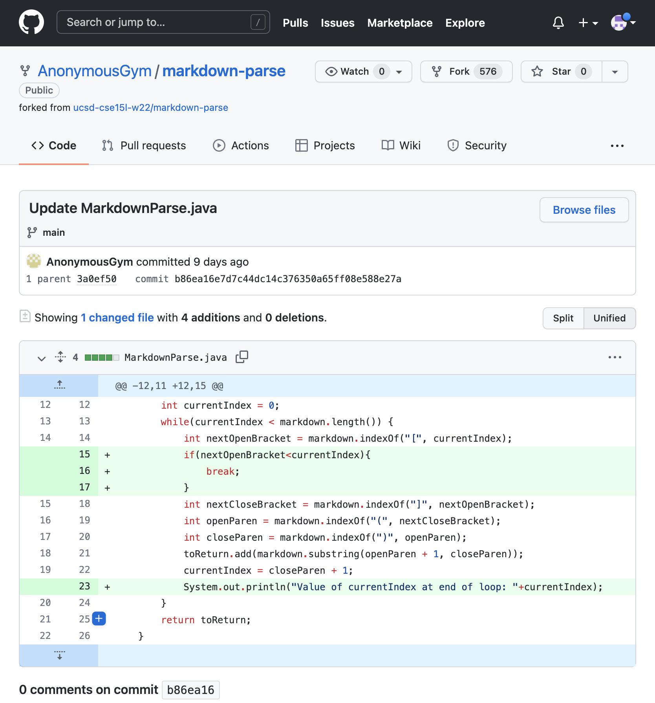
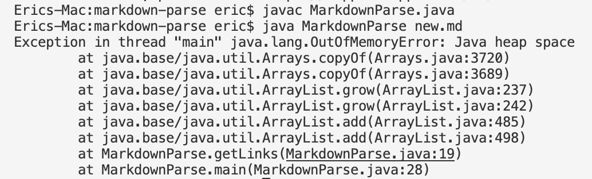
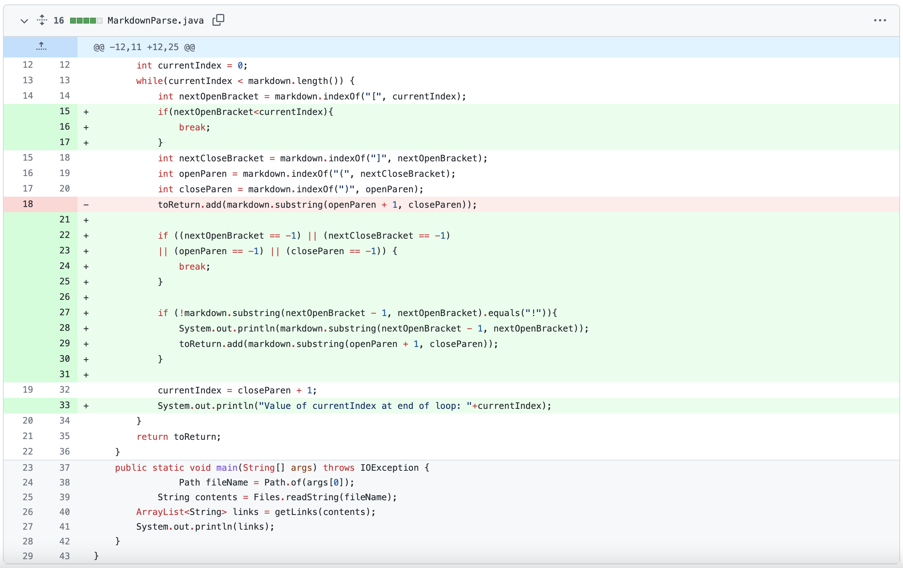
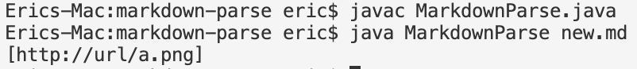

# Lab Report 1

***This lab report is a discussion of 3 code changes made in labs 3 and 4.***

***

**Code Change 1**

- This is a screenshot of the code change diff from Github: 

- This is a link to the test file that induce the error: [new.md](https://github.com/AnonymousGym/markdown-parse/blob/main/new.md?plain=1)

- This is a screenshot of the symptom of failure-inducing input: 

- The failure-inducing input triggers the failure, which shows up as the symptom, in this case, the exception.

    The symptom implies the bug that it will fail if the text does not end with a link.  

    The bug causes the symptom which is the exception.

***

**Code Change 2**

- This is a screenshot of the code change diff from Github: 

- This is a link to the test file that induce the error: [new.md](https://github.com/sha0xy/markdown-parse/blob/main/new.md?plain=1)

- This is a screenshot of the symptom of failure-inducing input: 

    This is a link to an image and should be distinguished from a normal link, thus should not be included in the output.

- The failure-inducing input triggers the failure, which shows up as the symptom, in this case, an unwanted output.

    The symptom implies the bug that the code can not distinguish normal link to image link.  

    The bug causes the symptom which is the unwanted output.

**Code Change 3**

- This is a screenshot of the code change diff from Github: 

- This is a link to the test file that induce the error: [new.md](https://github.com/sha0xy/markdown-parse/blob/main/new.md?plain=1)

- This is a screenshot of the symptom of failure-inducing input: 

    This is a link to an image and should be distinguished from a normal link, thus should not be included in the output.

- The failure-inducing input triggers the failure, which shows up as the symptom, in this case, an unwanted output.

    The symptom implies the bug that the code can not distinguish normal link to image link.  

    The bug causes the symptom which is the unwanted output.