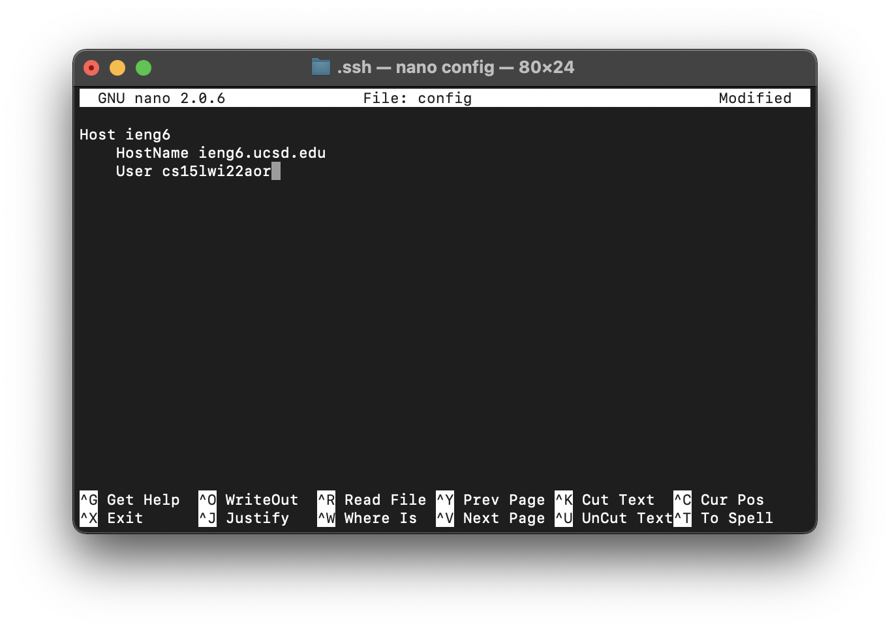
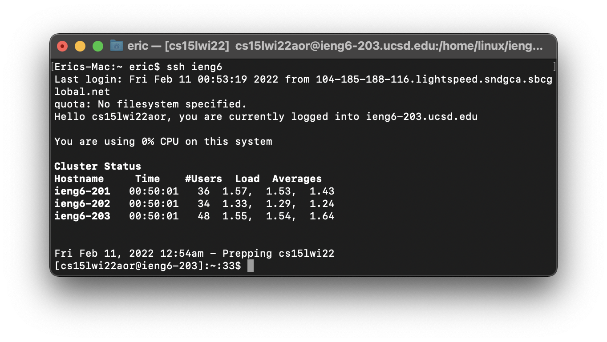
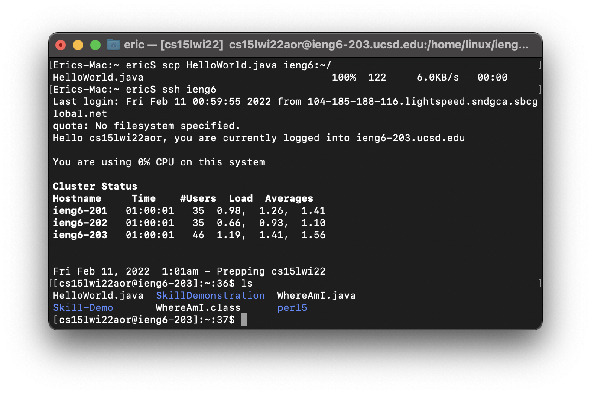

# Lab Report 3

***This lab report is a discussion of a group choice activity in lab 5. Specifically, it discusses the group choice 1 - Streamline `ssh` Configuration***

***

**Create and edit config file**

- This is a screenshot of the config file while I edited it: 

- There is no config file in the .ssh directory, so I created a new config file in the directory and edited it using `nano config`.

***

**Log into my account using `ssh`**

- This is a screenshot of logging into my CSE15L account using `ssh`: 

- We need to type `ssh cs15lwi22aor@ieng6.ucsd.edu` each time we want to log into our account. After editing the config file, we only need to type `ssh ieng6` (or other names if we set it differently). It saves a lot of time and make sshing easier.

***

**Copy file to my account using `scp`**

- This is a screenshot of copying a file to my CSE15L account using `scp`: 

- We need to type `scp (file name) cs15lwi22aor@ieng6.ucsd.edu:~/` each time we want to copy a file to our account. After editing the config file, we only need to type `scp (file name) ieng6:~/` (or other names if we set it differently). It saves a lot of time and make scping easier.

***

***-End of Lab Report 3-***
