# Lab Report 4

***This lab report is a discussion of a group choice activity in lab 5. Specifically, it discusses the group choice 1 - Streamline `ssh` Configuration***

***

**Markdown-parse Repository**

- [Link to my markdown-parse repository](https://github.com/sha0xy/markdown-parse)

- [Link to the markdown-parse repository I reviewed](https://github.com/jnhuang02/markdown-parse)

***

**Test for Code Snippet 1 in my markdown-parse**

- This is a screenshot of what it should produce:  

    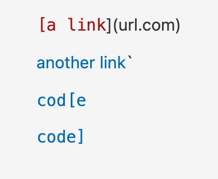

- This is a screeshot of the code of the test: 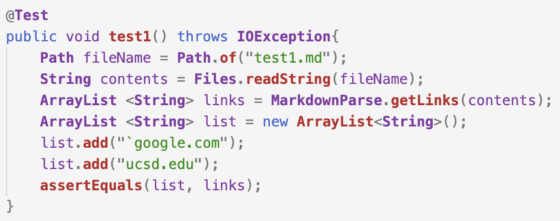

- This is a screenshot of the outcome of the test: 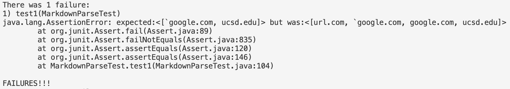

- I think there is not a small code change that will make my program work for snippet 1 and all related cases that use inline code with backticks. First of all, we need to find whether there is a pair of backticks in the test case, and then we need to find out whether the backticks are inside the brackets or either of them is outside of the brackets. Besides, we need to deal with brackets within the pair of backticks. There are too many issues to deal with.

***

**Test for Code Snippet 1 in the markdown-parse I reviewed**

- This is a screenshot of what it should produce: 

    

- This is a screeshot of the code of the test: 

- This is a screenshot of the outcome of the test: 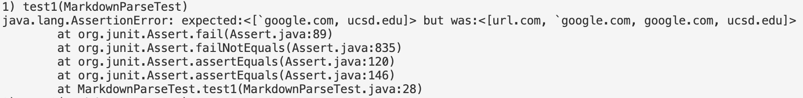

***

**Test for Code Snippet 2 in my markdown-parse**

- This is a screenshot of what it should produce: 

    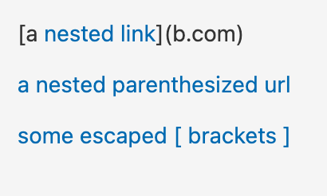

- This is a screeshot of the code of the test: 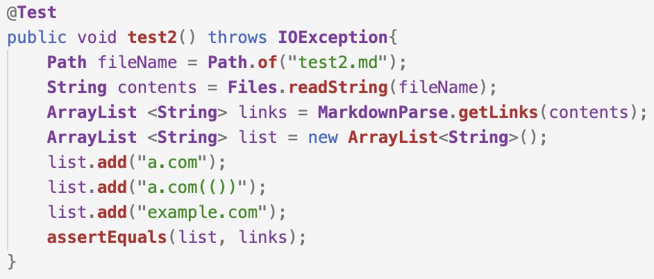

- This is a screenshot of the outcome of the test: 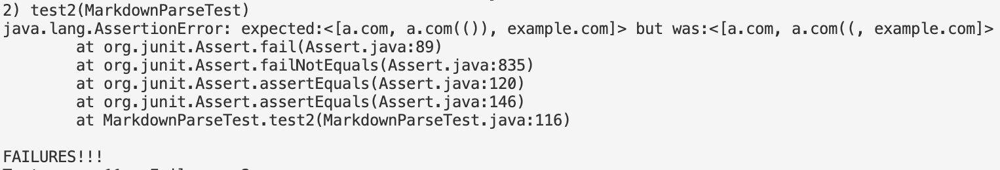

- I think there is not a small code change that will make my program work for snippet 2 and all related cases that nest parentheses, brackets, and escaped brackets. First, in order to include the nested link, we need to correctly pair the brackets, and then we need to exclude the outside link. We also need to pair the parentheses in order to find the real link. To identify escaped brackets, we need to distinguish normal brackets from escaped brackets. There are too many issues to deal with.

***

**Test for Code Snippet 2 in the markdown-parse I reviewed**

- This is a screenshot of what it should produce: 

    

- This is a screeshot of the code of the test: 

- This is a screenshot of the outcome of the test: 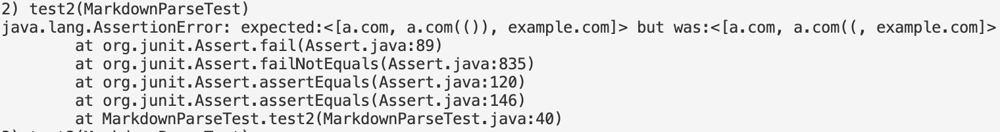

***

**Test for Code Snippet 3 in my markdown-parse**

- This is a screenshot of what it should produce: 

    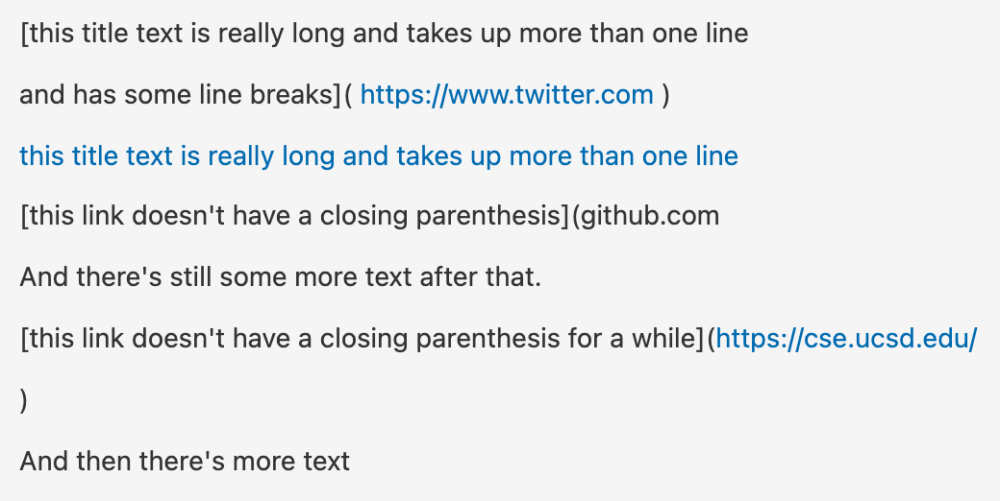

- This is a screeshot of the code of the test: 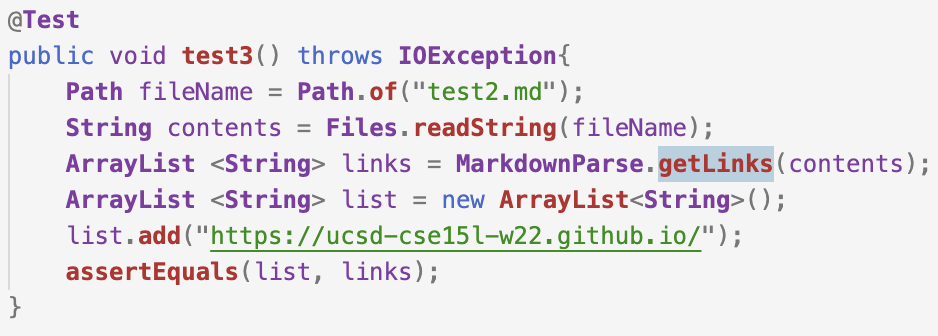

- This is a screenshot of the outcome of the test: 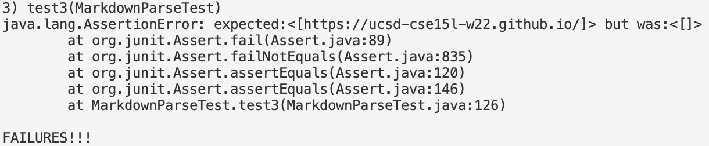

- I think there is not a small code change that will make my program work for snippet 3 and all related cases that have newlines in brackets and parentheses. First, we need to look for line breaks in the brackets and we need to distinguish them from normal newlines. Besides, we also need to decide whether the newlines in the parentheses would invalidate the link. There are too many issues to deal with.

***

**Test for Code Snippet 3 in the markdown-parse I reviewed**

- This is a screenshot of what it should produce: 

    

- This is a screeshot of the code of the test: 

- This is a screenshot of the outcome of the test: 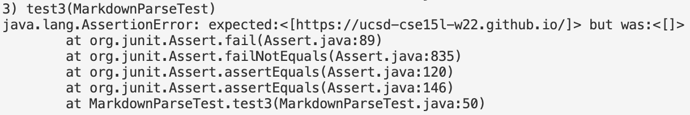

***

***-End of Lab Report 4-***