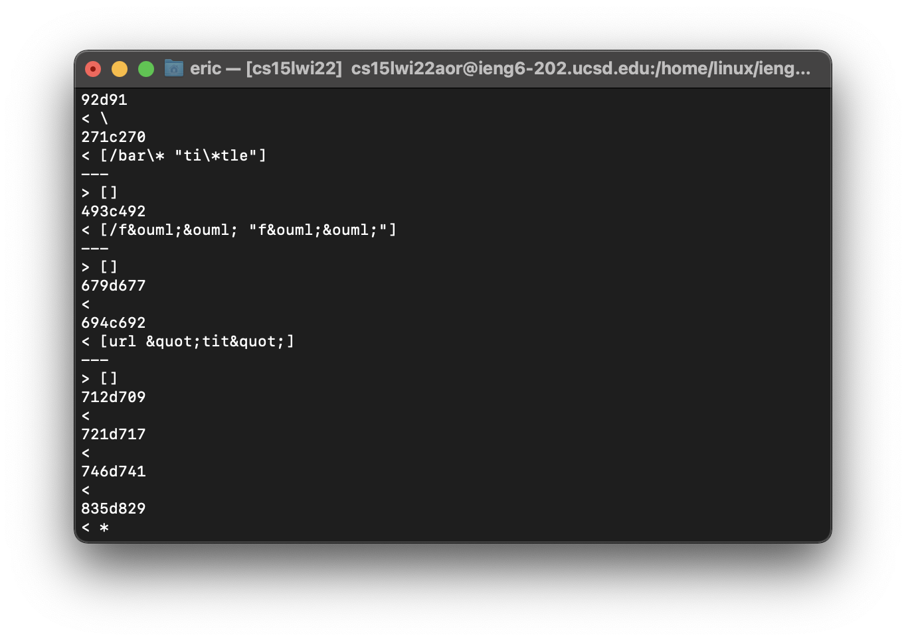
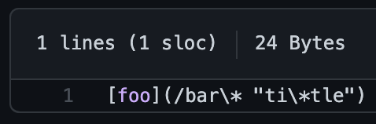
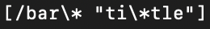
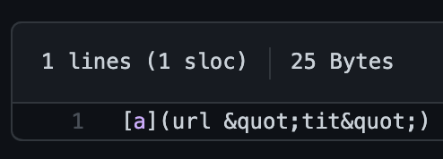
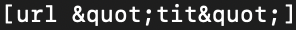
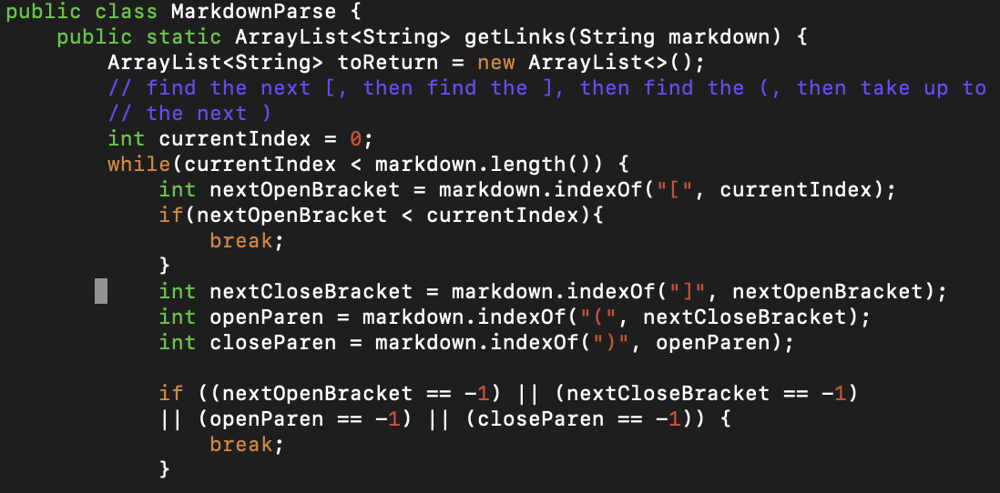

# Lab Report 5

***This lab report is a discussion of two different test results from my markdown parse repository and given markdown parse repository***

***

**Find tests with different results**

- To find tests with different result, I first save the test results in result.txt using the command `bash script.sh > results.txt`. Then, use `diff` to find the differences in the results. This is part of the outcome of `diff` command:

    

***

**Test 1 that has different results**
- This is a screenshot of the test file: 

    

- This is a screenshot of result from my implementation:  

    

- This is a screeshot of the result from given implementation: 

    

- The expected result is `[/bar\* "ti\*tle"]`

- My implement is correct.

***

**Test 2 that has different results**
- This is a screenshot of the test file: 

    

- This is a screenshot of result from my implementation:  

    

- This is a screeshot of the result from given implementation: 

    

- The expected result is `[]`

- My implement is incorrect. It fails to detect the space in link (stuff in the parenthesis) and include an invalid link in the output. There should be some code checking for spaces after the index of open parenthesis and before the index of close parenthesis. This is the screenshot of the part of the code needed to be fixed:

    

***

***-End of Lab Report 5-***